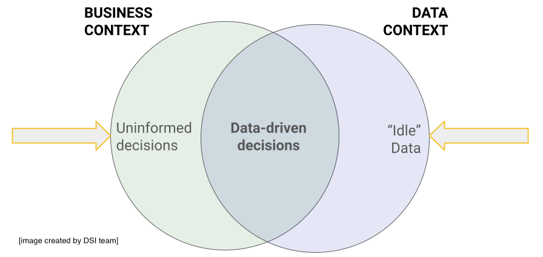

# Project Planning and Impact

```
$ echo "Data Sciences Institute"
```

<!-- Importance of planning in data science projects, overview of planning phases, and key considerations. -->

<!-- Speaker notes: Emphasize the necessity of structured planning for successful project outcomes. -->

--- 

# Review

* Yesterday, we discussed the goals of the Team Project and the value that it can bring to each of your portfolios. This is an opportunity to ***showcase the skills*** that you've learned, and your ability to apply them to a ***real-world problem*** to deliver ***real business value***.

* You should now be reasonably aligned with your team on the **industry** that you will be analyzing, the **business question** that you want to answer, and the **type of data** you will be using.

---

# Today's Content

1. Executing your project and dealing with uncertainty
2. Business impact
3. Expectations for today

---

# Executing Your Project

---

# Leveraging Project Management Methodologies

Explore methodologies like Scrum, Kanban, Waterfall, and Agile on your own. For now, let's focus on an essential concept: **spikes**.

**Spikes** are short, time-boxed research tasks designed to answer specific questions or solve particular problems before starting the main project work. They are designed to _reduce uncertainty_.

---


# Handling Uncertainty in Your Project

Throughout your project, there will be moments when you are unsure of how to proceed, or what task to work on next. The _Orders of Ignorance_ is a concept that can help guide you in these situations.

---

## [The Five Orders of Ignorance](https://www.5oi.org/the-five-orders-of-ignorance)

**A "meta-model of ignorance" that can help us put the unknowns of projects into context.**

0. Zeroth Order Ignorance (0OI): Lack of Ignorance
1. First Order Ignorance (1OI): Lack of Knowledge
2. Second Order Ignorance (2OI): Lack of Awareness
3. Third Order Ignorance (3OI): Lack of Process
4. Fourth Order Ignorance (4OI): Meta Ignorance

---

## [The Five Orders of Ignorance](https://www.5oi.org/the-five-orders-of-ignorance)

**0. Zeroth Order Ignorance (0OI): Lack of Ignorance**

* You know there is a door.
* You know where the door is.
* You can see the path to the door clearly.


---

## [The Five Orders of Ignorance](https://www.5oi.org/the-five-orders-of-ignorance)

**1. First Order Ignorance (1OI): Lack of Knowledge**

* You know there is a door.
* You do not know the path to the door, but you know you can find the path with a tool that you have (e.g. a flashlight).


---

## [The Five Orders of Ignorance](https://www.5oi.org/the-five-orders-of-ignorance)

**Second Order Ignorance (2OI): Lack of Awareness**

* You know there is a door, but you do not know how to get to it or where to start looking.


---

## [The Five Orders of Ignorance](https://www.5oi.org/the-five-orders-of-ignorance)

**Third Order Ignorance (3OI): Lack of Process**

* You know you are in a room, but don't know if there is any way out.


---

## [The Five Orders of Ignorance](https://www.5oi.org/the-five-orders-of-ignorance)

**Fourth Order Ignorance (4OI): Meta Ignorance**

* Complete and utter darkness.


---
## [The Five Orders of Ignorance](https://www.5oi.org/the-five-orders-of-ignorance)

* **Spikes** help us reduce the order of our ignorance!

---

# Benefits of Spikes

- **Clarify Requirements**: Quickly gather necessary information.
- **Solve Problems Early**: Address technical uncertainties before main development.
- **Prevent Delays**: Avoid excessive brainstorming that can stall progress.
- **Reduce Unknowns**: Lower the project's uncertainties.
- **Efficient Estimates**: Provide well-constrained estimates on specific work items.
- **Maximize Value**: A one-day spike giving 80% confidence can be more valuable than a three-day spike giving 90%.

---

# Strategic Planning for Short and Long-Term Goals

Setting realistic time frames for your project stages is crucial. Use S.M.A.R.T goals to structure your planning effectively:

- **Specific**: Define clear details about what needs to be achieved, who's involved, and where it will occur.
- **Measurable**: Establish concrete criteria for measuring progress and success.
- **Achievable**: Ensure the goals are realistic, considering available resources and constraints.
- **Relevant**: Align goals with broader business objectives to ensure they are meaningful.
- **Time-bound**: Set definitive deadlines to maintain focus and urgency.

<!-- Speaker notes: Discuss the importance of using the SMART framework to guide project planning. Emphasize how each element contributes to setting effective goals that are not only clear and actionable but also aligned with strategic business outcomes. -->

---

### Example: Customer Retention Model

**Scenario**: Develop a predictive model to improve customer retention for a subscription-based service.

- **Specific**: Machine learning model to predict customer churn using six months of user activity and demographic data.
- **Measurable**: Target 80% accuracy on a validation set.
- **Achievable**: Use Python’s Scikit-Learn and a marketing department dataset.
- **Relevant**: Aligns with the company’s goal of reducing churn and improving retention.
- **Time-bound**: Initial model version in three months, with testing and deployment in the next quarter.

---

### Example: Dataset Preparation

**Scenario**: Prepare a dataset for urgent customer feedback analysis.

- **Specific**: Clean feedback data from the latest product launch, removing duplicates and handling missing values.
- **Measurable**: No missing values or duplicates, verified by data quality checks.
- **Achievable**: Use Python’s Pandas library for data manipulation.
- **Relevant**: Crucial for immediate analysis to inform the marketing team’s next steps.
- **Time-bound**: Complete in two days to start analysis on schedule.

---

# ✅ Developing a Project Plan

1. Understand the business context.
2. Identify an opportunity.
3. Scope your analysis.
4. Develop your solution.
5. Present results and recommendations.

### 📋 To keep in mind:

* Are your insights *actionable?*
* How robust is your analysis? *Quantify!*
* What are the *risks* and *unknowns*?

---

# ✅ Developing a Project Plan

1. **Understand the business context**: "We want to increase customer engagement [by X%]."
2. **Identify an opportunity**: "Customer segmentation will enable targeted marketing campaigns, which should increase customer engagement."
3. **Scope your analysis**: "We will use feature engineering to create segments based on purchase history and demographic data."
4. **Develop your solution**: "We will k-means clustering with Python, and determine the optimal number of clusters using the elbow method."
5. **Present results and recommendations**

---
# Business Impact

---

# Why Business Impact Matters

Understanding and articulating the business value of your data science and machine learning projects is crucial for two main reasons:

### Benefits:

- **Educational**: Apply new technologies and methodologies from both data science and machine learning.
- **Employability**: Showcase your ability to solve real-world problems, making you attractive to potential employers.

Highlight your skills through projects by using relevant industry examples and metrics, such as operational improvements, technical innovations, or strategic insights.

<!-- Speaker notes: Emphasize aligning data science and machine learning projects with business goals. Highlight that demonstrating business impact is about tackling complex problems and delivering meaningful insights. This supports your professional development and attractiveness to employers. Provide examples of techniques and frameworks used to showcase hands-on experience and technical proficiency. -->

---

# Delivering Business Value

* Creating business value means allocating resources (e.g. money, employees, time, hardware) in the way that generates the best return.
    * As a technical team, it is your job to enable the strategic decision makers with the information they need.



---

# Examples Across Sectors (Part 1)

### Healthcare Example
"***Improved patient outcomes*** by developing a predictive model using Python and scikit-learn. Data was preprocessed using pandas to handle missing values and standardize features. Logistic regression was selected through cross-validation due to its interpretability and performance."

### Retail Example
"***Optimized inventory management*** with SQL and Tableau. Data was cleaned and aggregated using SQL queries to identify sales patterns. Visualizations in Tableau helped to ***forecast demand, leading to cost savings of 5%."***

*⏭️ Continued on next slide...*

---

# Examples Across Sectors (Part 2)

### Marketing Example
***Increased customer engagement by 8%*** by performing customer segmentation using k-means clustering with Python. Feature engineering was conducted to create meaningful segments based on purchase history and demographics. The optimal number of clusters was determined using the elbow method, which helps identify the point where adding more clusters does not significantly improve the model.

---

# Demonstrating Technical and Business Skills

- **Demonstrate Coding Proficiency**: All projects should showcase your ability to write clean, efficient, and well-documented code.
- **Showcase Communication Skills**: All projects should effectively communicated complex data-driven insights to non-technical team members.

Your ability to document code clearly and communicate effectively can drastically reduce onboarding times for new team members and help non-technical stakeholders make informed decisions, thereby enhancing overall project success and team efficiency.

---

# Communicating & Presenting Your Findings

---
# Making Complex Concepts Accessible

Communicating complex data science concepts clearly is essential for audiences without technical backgrounds, **including recruiters and HR teams.**

Strategies to Enhance Understandability:
- **Use Analogies and Metaphors**: Bridge understanding gaps with relatable comparisons.
- **Incremental Explanation**: Simplify concepts step-by-step.
- **Visual Aids**: Employ diagrams and infographics for clarity.

Clear communication ensures your projects are comprehensible to all, enhancing your professional appeal and broadening project impact.

<!-- Speaker notes: Emphasize the need to make data science projects accessible to non-experts, including those in HR and recruitment. Discuss using analogies, incremental explanations, and visual aids to clarify complex ideas. This approach not only makes your work more impactful but also supports your candidacy during job evaluations. -->

---

# Example of Making Complex Concepts Accessible

### Remember the "Healthcare Example" above?

Before:
```
"Improved patient outcomes by developing a predictive model using Python and scikit-learn. Data was preprocessed using pandas 
to handle missing values and standardize features. Logistic regression was selected through cross-validation due to its 
interpretability and performance."
```
After:
```
“Improved patient outcomes by developing a predictive model using Python and scikit-learn. Think of the predictive model as a way
to forecast patient health based on past data, much like predicting the weather. Data was preprocessed using pandas to handle
missing values and standardize features. This preprocessing is like organizing and cleaning up messy medical records to ensure all
information is complete and consistent. Logistic regression was selected through cross-validation due to its interpretability and
performance. Imagine trying  different medical treatments and choosing the one that consistently gives the best results; that’s 
what cross-validation does for model selection.”

```

This approach effectively communicates complex concepts to both technical and non-technical audiences, ensuring clarity and comprehension across diverse stakeholders.

---

# How to Effectively Communicate Business Impact

Showcase your project’s business value by applying specialized skills:

- **📊 Data Science Stream**: Apply the techniques learned in your sampling and visualization modules to deliver impactful data insights.
- **⚙️ Machine Learning Stream**: Demonstrate model efficiency and algorithm optimization with detailed performance graphs and clear pipeline visualizations.

Ensure your presentations translate complex data into clear, actionable business insights.

<!-- Speaker notes: Encourage Data Science stream participants to apply their sampling and visualization techniques effectively. Machine Learning stream participants should focus on illustrating model efficiency and optimization. Emphasize that both groups need to communicate how their projects provide tangible business value to potential employers. -->

---

# Final Presentation & Feedback Session

- This day is for showcasing your progress on the project goals so far. It’s not about meeting all the requirements yet, but about presenting what your project is about, what you’ve done, and what you plan to do next. It’s also a chance to get feedback and ideas from your fellow participants. 
- Each team has a maximum of 5 minutes to present. Put your best foot forward, as you may never get such a diverse audience of this size again. The audience is comprised of your fellow participants, who now have a good background in data science and machine learning, and have extensive expertise in their respective industries. They will serve as judges and provide valuable feedback.

---

# Next Steps Post-Certification

As you transition from the certificate, continue to build and showcase your skills.

### Strategies for Continuous Growth:

- **Active Portfolio**: Aim for 5-6 substantial projects to demonstrate a broad range of skills. Focus on quality over quantity.
- **Explore and Learn**: Continue exploring new areas within data science and machine learning to keep your knowledge current and dynamic.
- **Peer Collaboration**: Participate in group projects with fellow participants to enhance your skills and widen your professional network.

Actively applying for jobs should proceed in tandem with these activities.

<!-- Speaker notes: Emphasize that maintaining a portfolio with 5-6 diverse projects is ideal for demonstrating a commitment to the field and depth of skills. Clarify that the focus should be on the quality of projects rather than simply meeting a numerical target. Encourage participants to continuously apply for jobs, using their portfolios to strengthen their applications and showcase their ongoing engagement and expertise. Remind them that even after the modules end, they still have access to the Slack community (more information will come out later). This platform can be a valuable resource for finding project partners, asking questions, and getting feedback on their work. Additionally, advise them to present completed projects on LinkedIn. This not only timestamps their active engagement in relevant projects during job searches but also enhances their visibility and personal branding on a professional network. -->

---
# Team Goals for Today

1. Dig deeper into your business question to understand the value your will be delivering. ***Who are your stakeholders and why do they care about your project?***

2. Explore your dataset. Is it clean? What are its limitations? ***Will you be able to answer your question with this dataset?*** Start your analysis.

3. Add your project plan to your team's README file. This plan should include details on:
    * What value does your project bring to the industry?
    * How will you answer your business question with your chosen dataset?
    * What are the risks and uncertainties?
    * What methods and technologies will you use?

4. Assign data cleaning and analysis tasks to team members.

---

# Team Goals for Today

Conduct a practise stand-up with your team! You should each be able to talk about:

* What you worked on yesterday.
* What you are planning to do today.
* Do you have enough detail to work on your tasks?
* Are there any blockers?

---

# Questions?